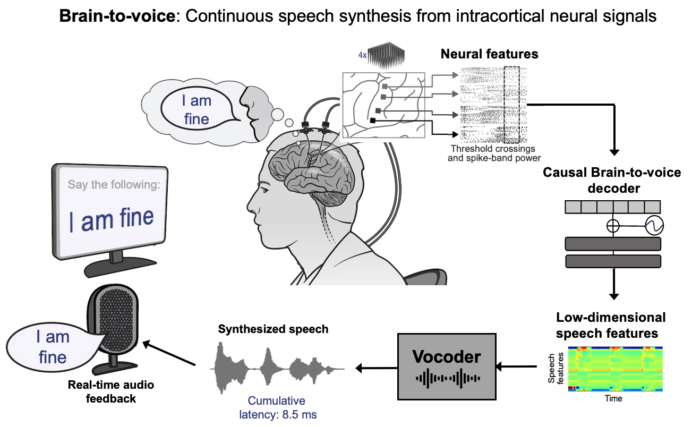

# An instantaneous voice synthesis neuroprosthesis

*Nature* (2025)

Maitreyee Wairagkar, Nicholas S. Card, Tyler Singer-Clark, Xianda Hou, Carrina Iacobacci, Lee M. Miller, Leigh R. Hochberg, David M. Brandman*, Sergey D. Stavisky*    
<sub> **Co-senior authors* </sub>

**Paper:** https://doi.org/10.1038/s41586-025-09127-3

Open access link: https://rdcu.be/eqH3C     
Preprint: https://doi.org/10.1101/2024.08.14.607690

## Overview

This repository contains the code for the training and offline implementation of the brain-to-voice synthesis methods described in the paper *"An instantaneous voice synthesis neuroprosthesis"*. A demo to synthesize voice from intracortical neural signals during speech task is provided. 

<p align="center">
    
</p>

## Installation

### 1. System requirements:
This code runs on a GPU for optimal performance. It has been tested on Linux (20.04) with RTX 3090 GPU and RTX A6000 GPU as well as on MacOS (13.5) with M1 Pro processor. 

### 2. Python environment:
Set up a new conda environment `b2voice_env` using the provided `requirements.yml` for Linux as follows:

```
conda env create --file requirements.yml
conda activate b2voice_env
```
This will install all the required Python packages to run this code (installation will take around 15-20 minutes). 

### 3. Install LPCNet:
Brain-to-voice synthesis uses a pre-trained LPCNet vocoder which can be installed from here https://github.com/xiph/LPCNet. Install this into the `dependencies` folder. This installation will take around 7-10 mins. 

## Data setup

The dataset contains individual trials of neural features recorded during the speech task as well as the pre-trained brain-to-voice decoders to synthesize voice from these neural trials. Data can be downloaded from [Dryad](https://doi.org/10.5061/dryad.2280gb64f). Save the downloaded folders `t15_neural_data` and `t15_control_experiment` in the `data` folder provided in this repository. 

## Training
A new brain-to-voice model can be trained using `training.ipynb` notebook. It handles data loading and formatting, model initialisation, and training. All file paths and hyperparameters are configured in `configs/config.yaml` and the list of training sessions is specified in `configs/training_data_args.yaml`.

Model checkpoints are saved to `ckpt/` as a `.tf` file, and a lightweight inference-ready `.h5` model is saved alongside it.

## Inference — Demo for brain-to-voice synthesis

A demo to synthesize voice from neural activity using the brain-to-voice decoder is provded in the `inference.ipynb` notebook. Run the notebook to load the data, the decoder and then run the inference on each trial individually to synthesize intelligible voice. In the offline implementation, output audio files are generated and saved in the `aud` folder. 

The README files within each folder provide further information.